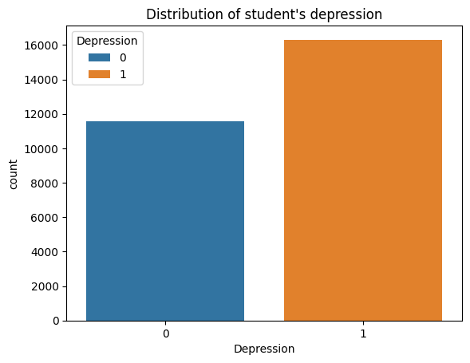
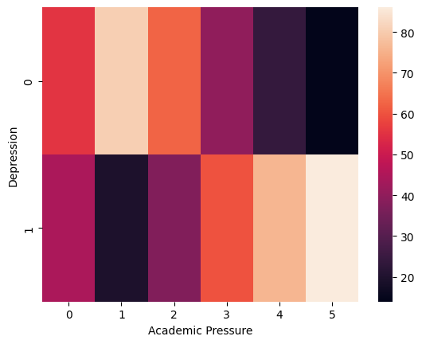
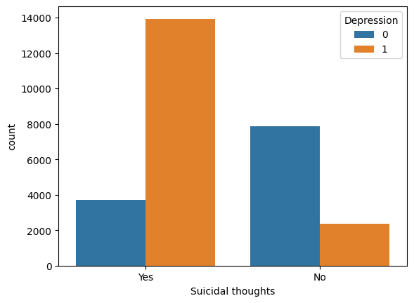

# 🧠 Exploratory Data Analysis on Student Mental Health

## 📌 Overview
Mental health issues among students are increasing due to academic pressure, lifestyle habits, and personal challenges.

This project focuses on performing **Exploratory Data Analysis (EDA)** on a student mental health dataset to uncover patterns, relationships, and key factors influencing depression.

---

## 🎯 Objective
- Analyze student mental health data  
- Identify factors contributing to depression  
- Understand behavioral and academic impact  
- Generate insights for awareness and improvement  

---

## 📂 Dataset Description
The dataset includes various features related to student life:

- **Age**  
- **Gender**  
- **City**  
- **Profession**  
- **Degree**  
- **CGPA**  
- **Study Satisfaction**  
- **Academic Pressure**  
- **Work/Study Hours**  
- **Sleep Duration**  
- **Dietary Habits**  
- **Financial Stress**  
- **Family History of Mental Illness**  
- **Suicidal Thoughts**  
- **Depression (Target Variable)**  

---

## ⚠️ Data Cleaning & Preprocessing
- Handled inconsistent and noisy data  
- Fixed formatting issues  
- Checked for unrealistic values  
- Prepared dataset for analysis  

---

## 🛠️ Tech Stack
- Python  
- Pandas, NumPy  
- Matplotlib, Seaborn  
- Jupyter Notebook  

---

## 🔄 Project Workflow
1. Data Loading  
2. Data Cleaning & Preprocessing  
3. Exploratory Data Analysis (EDA)  
4. Data Visualization  
5. Insight Generation  

---

## 📊 Key Visualizations

### 🔹 Depression Distribution
This plot shows the proportion of students experiencing depression versus those who are not.


---

### 🔹 Academic Pressure vs Depression
This visualization highlights how increasing academic pressure impacts the likelihood of depression.


---

### 🔹 Suicidal Thoughts vs Depression
This graph shows a strong relationship between suicidal thoughts and depression levels.


---

## 💡 Key Insights
- Higher academic pressure is strongly associated with increased depression  
- Students with suicidal thoughts show a significantly higher likelihood of depression  
- Mental health is influenced by a combination of academic and personal factors  

---

## 💼 Real-World Impact
- Helps institutions understand student mental health challenges  
- Supports early identification of at-risk students  
- Can guide mental health awareness initiatives  
- Encourages data-driven decision-making  

---

## 🚀 How to Run the Project
```bash
git clone https://github.com/your-username/student-mental-health-eda.git
cd student-mental-health-eda
pip install -r requirements.txt
jupyter notebook
